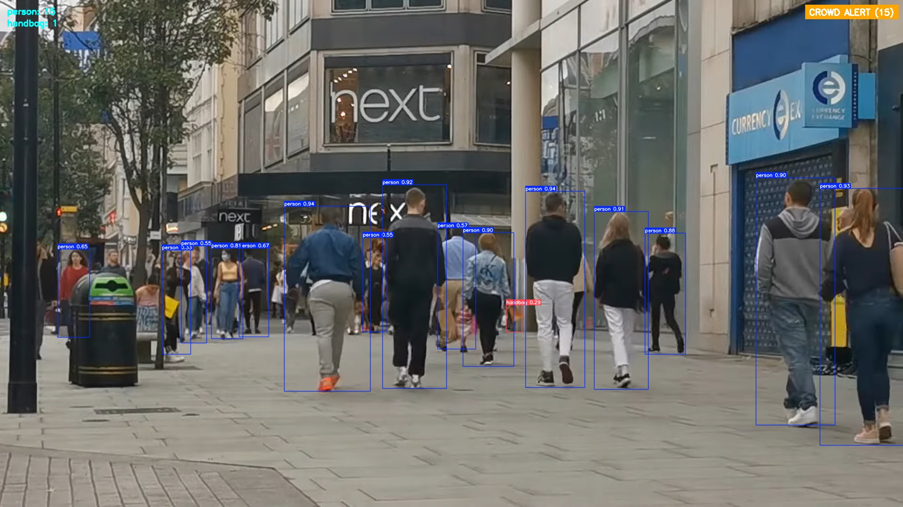
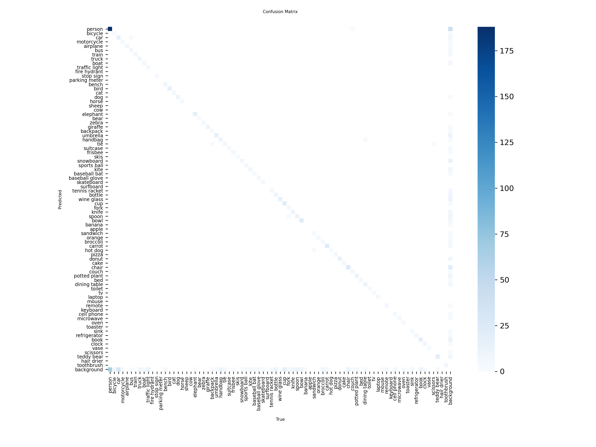
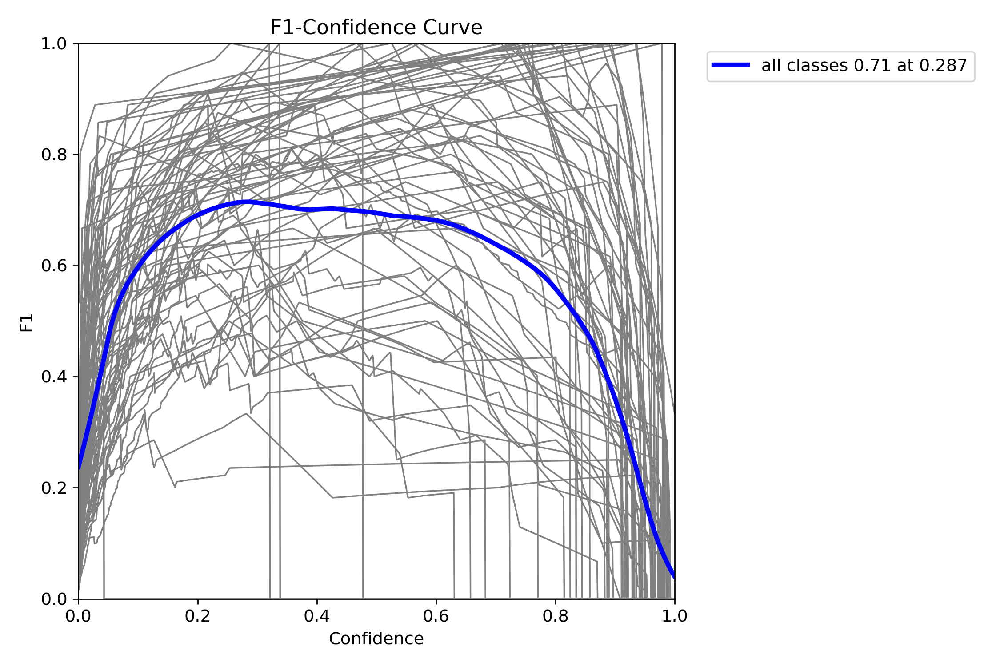
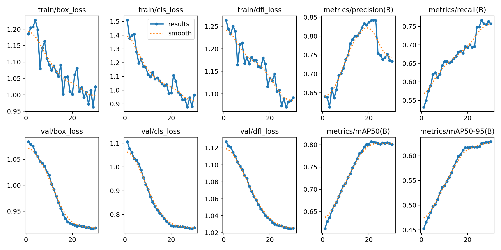

# Object Detection-Based Intelligent Traffic and Crowd Sureveillance using YOLOv8

A computer vision–based object detection system built using YOLOv8 to monitor traffic congestion and crowd density in real time. The project supports image detection, live webcam detection, dynamic alerting, and logging, making it suitable for smart surveillance.

---

## **Live Detect Demo**


---

## **🧠 Use Case**

This system can be used in:

- Smart traffic monitoring

- Crowd management in public places

- Surveillance systems

- Smart city applications

---

## **Project Structure**

```
Object-Detection-Project/
│
├── model/
│   └── best.pt                             # Trained YOLOv8 model
│
├── images/
│
├── notebooks
│   └── obj-detection.ipynb                 # Notebook for training, evaluating, and saving the model
│
├── output/
│   ├── output.jpg                          # Image detection result
│   ├── output.mp4                          # Webcam recorded output
│   └── alerts.log                          # Alert log file
│
├── venv/                                   # Virtual environment directory for dependency isolation
│
├── utils.py                                # Counting, alerts, logging
│
├── image_detect.py                         # Image detection script
│
├── webcam_detect.py                        # Webcam detection script
│
├── requirements.txt                        # Complete list of required Python packages
│
├── .gitignore                              # Tells Git what to ignore
│
└── README.md                               # Project description, setup instructions, usage guide
```

---

## **Usage**

1. Image Detection:

```bash
python app/image_detect.py  
```

- Loads the trained YOLOv8 model
- Performs object detection on the input image
- Draws bounding boxes with confidence scores
- Displays object counts (person, car, truck, etc.)
- Triggers Crowd / Traffic alerts if thresholds are exceeded
- Saves the output image to the output/ directory

2. Live Webcam Detection

```bash
python app/webcam_detect.py 
```

- Opens your default webcam
- Performs real-time YOLOv8 inference
- Displays:
    - Bounding boxes with class names & confidence
    - FPS (frames per second)
    - Live object counts
    - Dynamic Traffic & Crowd alerts
- Saves the recorded video automatically to output/output.mp4
- Logs alert events with timestamps in output/alerts.log

3. Controls

- Press q to stop the webcam
- Or simply close the display window
- Output files are saved automatically

---

## **Example Output**

### **Crowd**



### **Traffic**


---

## **Results**

### **Confusion Matrix**



### **F1 Curve**



### **Training and Validation results**



---

## **Author**

Devansh Khanduri
